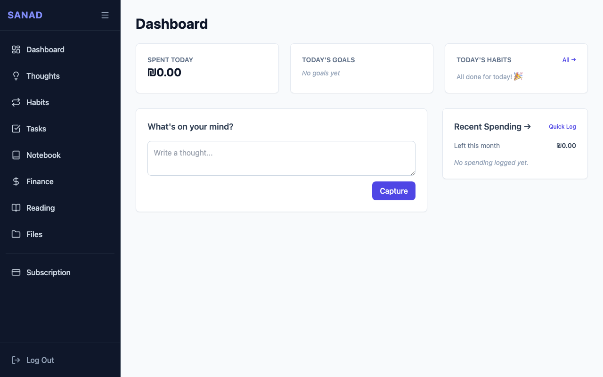
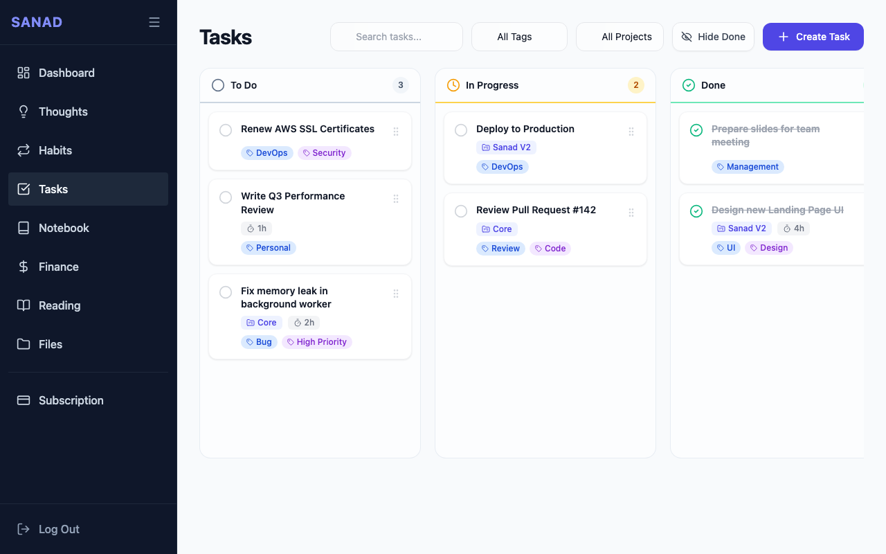
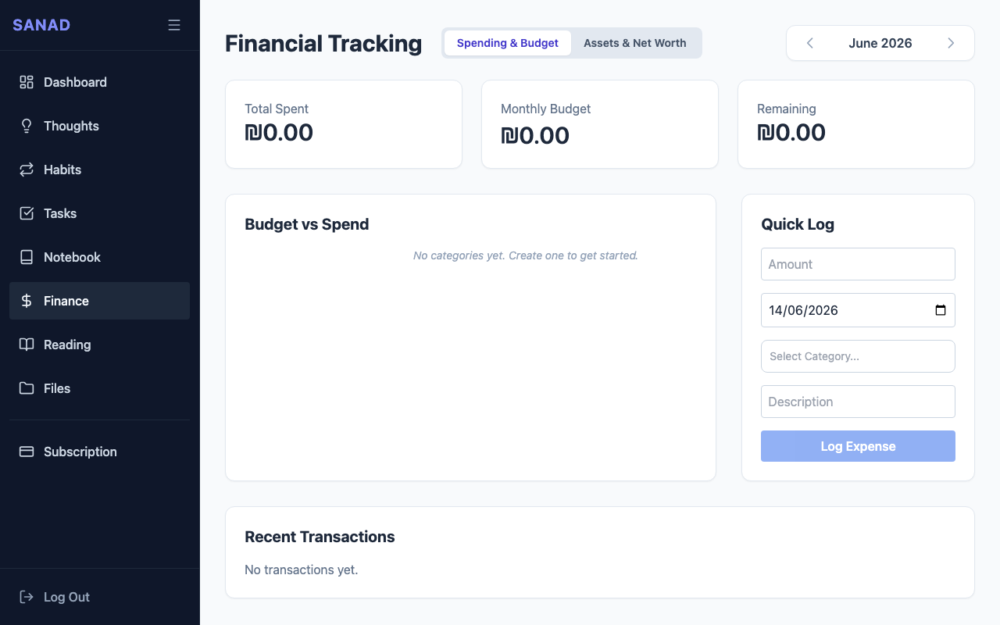
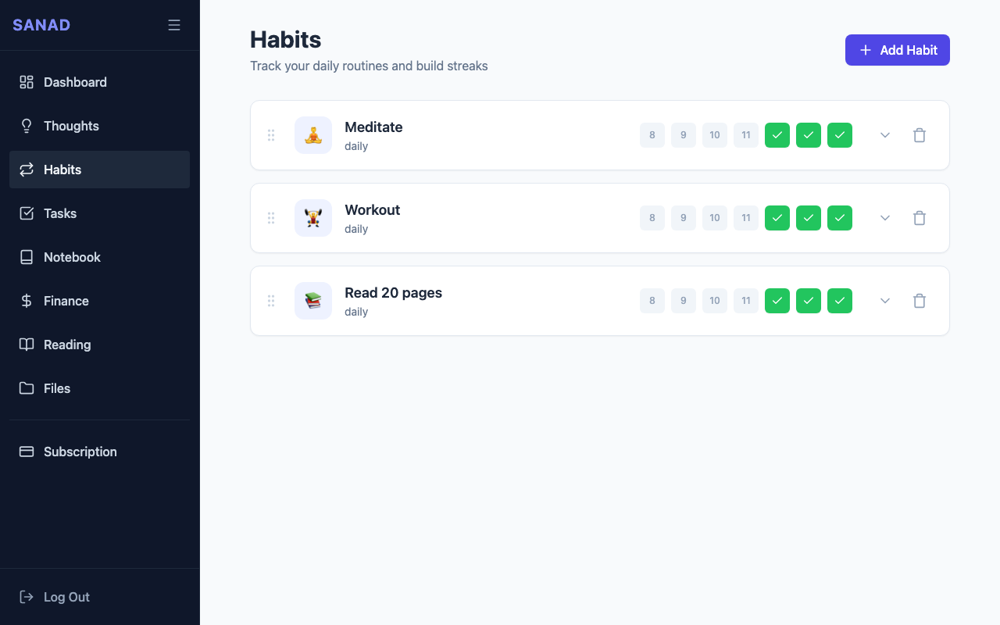
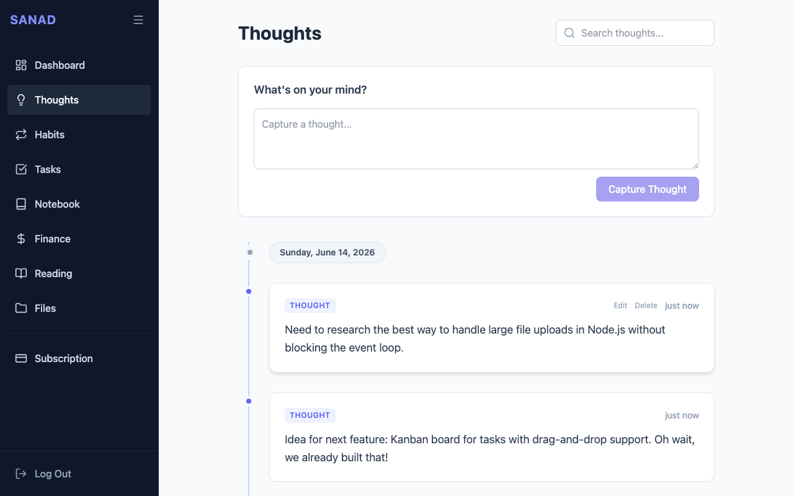
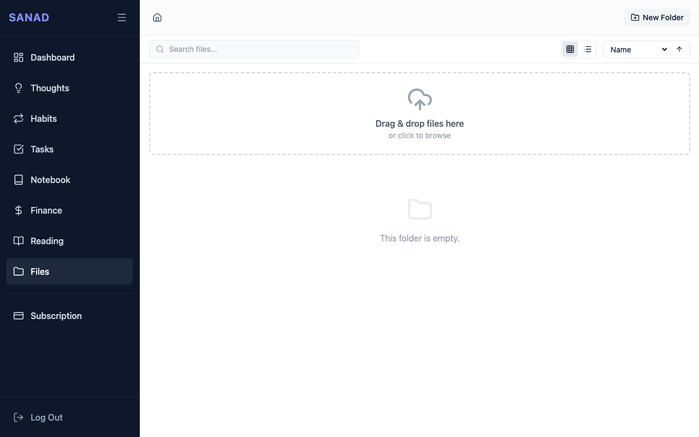

# [Sanad](https://sanadcloud.app)

Sanad is a comprehensive personal management application designed to help you organize various aspects of your life. It provides a centralized hub to track your tasks, notes, finances, reading progress, and daily thoughts, giving you a holistic view of your productivity and personal growth.

## Screenshots

<details>
<summary>Dashboard</summary>
<br>


</details>

<details>
<summary>Tasks</summary>
<br>


</details>

<details>
<summary>Finance</summary>
<br>


</details>

<details>
<summary>Habits</summary>
<br>


</details>

<details>
<summary>Thoughts</summary>
<br>


</details>

<details>
<summary>Files</summary>
<br>


</details>

## Features
- **Task Management**: Create, organize, and track daily tasks and goals.
- **Notes & Thoughts**: Capture thoughts quickly and organize detailed notes into notebooks using a rich-text editor.
- **Finance Tracking**: Manage your transactions, categorize expenses, track budgets, and monitor asset snapshots over time.
- **Books & Reading Progress**: Manage your personal bookshelf, track current reads, log reading progress, and maintain reading plans.
- **Habit Tracking**: Define daily, weekly, or monthly routines, visualize your consistency with a 90-day heat map, and build streaks.
- **File Management**: Upload, organize, and preview files seamlessly. Includes full pagination, server-side sorting/filtering, recursive folder management, chunked uploads for large files, and direct browser-to-disk folder downloads.
- **Multi-Tenancy**: Each user has their own separate database to ensure complete data isolation.
- **MCP Builtin for AI Agents**: connect your favorite AI agents, allowing them to help you organize tasks, sort files, and track finances autonomously and securely.

## Stack
**Frontend**:
- React 19
- Vite
- Tailwind CSS
- Zustand (State Management)
- Recharts (Data Visualization)
- Tiptap (Rich Text Editor)

**Backend**:
- .NET 10 Web API
- C#
- Entity Framework Core (SQLite Database)
- BCrypt (Authentication)
- Model Context Protocol (MCP) for .NET

## Getting Started

### Frontend
To run the frontend development server:
```bash
cd frontend
npm install
npm run dev
```

### Backend
To run the backend API server:
```bash
cd src/Sanad.Api
dotnet run
```

## License
This project is licensed under the MIT License.
